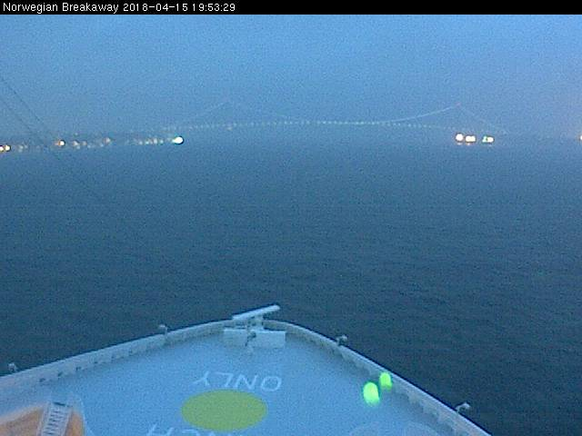
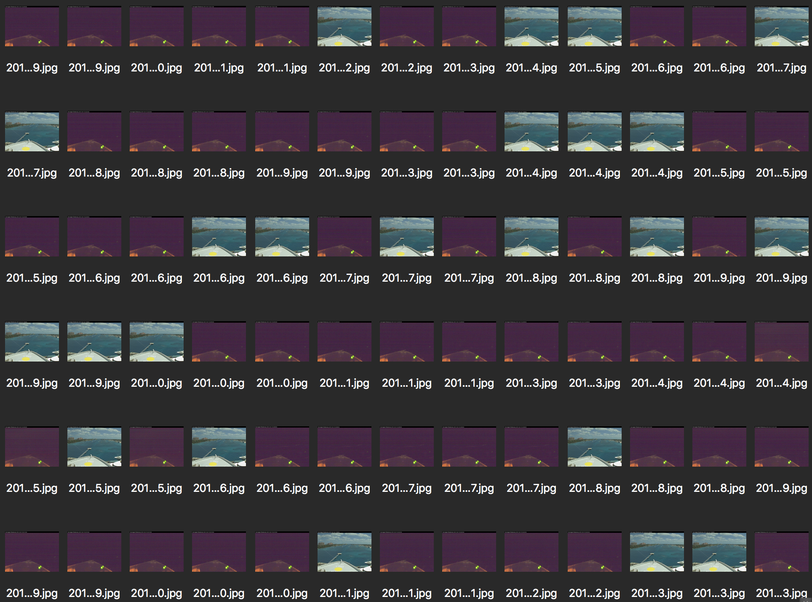
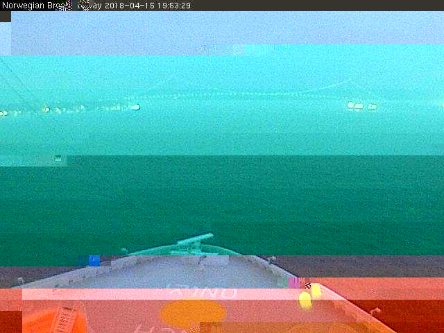

# Making a movie from a webcam capture

Carmella is taking a cruise on a ship which has a webcam, mounted above the bow, which once a minute gives [an updated image](https://www.ncl.com/shipcams/bawaycam/fullsize.jpg).

<br>_2018-04-15 The Norwegian Breakaway leaves Manhattan._

## Grabbing the images from the webcam

I want to grab each of these images and turn them into a time-lapse movie of the journey. The following bash script

1. grabs the current image
2. names it with 
	* the current date-time and 
	* the MD5 hash (a short string that uniquely identifies the content of the image, for checking for duplicate images

```
#!/bin/bash
# ---------------------------------------------------------------------
# Every $sec seconds grab an image from $url, naming with the time of
# capture (in Universal Coordinated Time (UCT) and the MD5 hash (to be
# able to identify duplicate captured images).
# ---------------------------------------------------------------------
url="https://www.ncl.com/shipcams/bawaycam/fullsize.jpg"
sec=30

for (( ; ; ))                       # forever
do
    d="$(date -u +%Y%m%d_%H%M%S)"   # now "20181225_123456" (UTC)
    n="${d}.jpg"                    # image file name & extension
    curl -o "$n" "$url"             # grab from $url, save as $n
    m="$(md5 -q "$n")"              # calculate MD5 has of image
    mv "$n" "$d-$m.jpg"             # put hash value in filename
    sleep "$sec"                    # wait a while to grab again
done
```

The result is an ever-growing number of images stored in the current directory, like:

```
20180419_163915-49a03206e127b35104e812478bcfd6aa.jpg
20180419_163946-49a03206e127b35104e812478bcfd6aa.jpg
20180419_164017-f60d98b34d36fb556e9b12c40af7fa45.jpg
20180419_164048-f60d98b34d36fb556e9b12c40af7fa45.jpg
```

We _could_ defer the MD5 hash to a later time, in the case that the images are being updated so quickly that we are forced to obtain them so quickly that we don't have time to compute the MD5, but that's not the case here.

## Handling duplicate images

Calculating the MD5 hash seems unnecessary, at first glance. There are several wrinkles in our real-world workflow that require the hash.

### Wrinkle #1 - capture faster than new image creation period

In a perfect world the cruise ship would send an updated image every minute, we'd grab once a minute, and we'd have a collection of unique photos.

In the real world, though, there are several obstacles:

1. Actual delivery is just a bit more or less than the advertised periodicity. There are a lot of moving parts between the ship and their company webserver, none of which are in our control, so
	* a slightly longer time between new images means that we're slightly out of sync, and we'll drift until we miss an image
	* a slightly shorter time between new images means we'll fetch duplicate images
	* any transmission issues anywhere between the ship and our script means we'll wind up with a garbled image file that can't be use. Fetching at (say) half the periodicity doubles our chances for getting a good image, but it results in two duplicate images every time through our loop.

So, for whichever combination of reasons, we need to identify duplicates and throw them away before we make our movie.

```
#!/bin/bash
# ---------------------------------------------------------------------
# Process a directory of images named TIMESTAMP-MD5HASH.xxx and throw
# away all but one of each MD5 hash.
# ---------------------------------------------------------------------
for f in *.jpg                  # iterate over all the image files
do
    parts=(${f//-/ })           # MD5 hash in filename follows '-'
    i=0                         # always start at the beginning...
    for g in *${parts[1]}       # for all files with the same MD5
    do
        if (( i != 0 )) ; then  # if not the first (or only) match
            mv "$g" ~/.Trash/   # move the duplicate to the trash
            echo -n 'X'         # give the human some feedback
        fi
        ((i++))                 # focus on the next match
    done
done
```

### Wrinkle #2 - repeated bad input

In a normal world, the current image is copied from the ship's webcam to the webserver documents directory and then is available to view.

What I'm actually seeing is someone copying an old image of the ship in a tropical port a month ago to the webserver, smashing the current image with an obsolete, useless one. This is what it looks like on my end, with the current images being the dark nighttime and the light images being the obsolete images.

<br>_Someone is inserting repeated out-of-date images._

It's the same obsolete image being shared again and again, so all of them will have the same MD5 hash. Our previous code will weed out multiples but will leave one bad image. I've manually identified the mad image's MD5 hash, so I know that I must 

```
mv *ba2e0e8b50954a298ab201e270d2c494* ~/.Trash/
```

to get the last of the bad images into the Trash.

### Wrinkle #3 - corrupted image files

Another side-effect of pulling data across the 'net is that sometimes the results are corrupt. The following example shows one such corruption. The kind of image you wind up seeing, or not seeing, depends entirely on what part of the image header is corrupted.

<br>_Sometimes images arrive corrupted._

In any case, once you double-check that you've got uncorrupted images near the corrupt one, you can throw it away. (If too many are corrupted, and you don't have any other options, you may have to make your time-lapse movie including the corrupt images.)

The following script uses the [ImageMagic](https://www.imagemagick.org/) `identify` command to determine which image files are corrupt.


```
#!/bin/bash
# ---------------------------------------------------------------------
# Process a directory of images, moving corrupt ones to the Trash.
#
# Requires ImageMagick's "identify" command.
# ---------------------------------------------------------------------
for f in *.jpg                      # iterate over all the image files
do
    if ! identify -verbose "$f" >/dev/null ; then
        mv "$g" ~/.Trash/           # move corrupt to the trash
        echo -n 'X'                 # give the human some feedback
    fi
done
```

## Making a movie from the images

Now that we've winnowed the good images from the bad, we're left with a directory full of images that start with a datetime, so they sort from earliest to latest, exactly what we want for making a movie.

Use ImageMagic's `convert` command to assemble the stills into a video:

`convert -delay 5 -quality 100 *.jpg output.mpg`

You can see my other webcam-to-movie captures:

* [Through the Panama Canal on the Island Princess](https://www.youtube.com/watch?v=JVvjriBBNhs)
* [14 ¼ hours at Puntarena, Costa Rica, in 38 seconds](https://www.youtube.com/watch?v=6JSYjEm7ROc)
* [Oranjestad, Aruba, to Cartagena, Colombia, on the Island Princess](https://www.youtube.com/watch?v=FhQDG822Yfo)

I hope you find this helpful, for when you're faced with a similar challenge.
